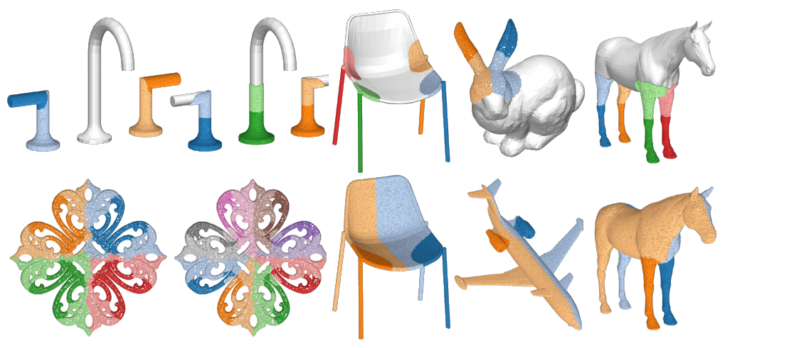

# SymCL — Partial Symmetry Detection for 3D Geometry

Official implementation of

> **Partial Symmetry Detection for 3D Geometry using Contrastive Learning with Geodesic Point Cloud Patches**
> Gregor Kobsik, Isaak Lim, Leif Kobbelt
> *Vision, Modeling, and Visualization (VMV) 2026*

<p align="center">
  
</p>

SymCL detects **partial extrinsic symmetries** (rotational, translational, reflective — multi-instance, of arbitrary arity) in 3D shapes. Local geodesic patches are embedded into an E(3)-invariant latent space via self-supervised contrastive learning; symmetry detection then becomes density-based clustering, discovering all symmetry groups in a single forward pass.

## TODO

- [x] Release code
- [ ] Release SymPartNet benchmark annotations (`sympartnet.zip`)
- [ ] Release pretrained checkpoint (`run_37809.zip`)
- [ ] Release precomputed data for the paper's qualitative shapes (`precomputed.zip`)
- [ ] Release Mitra et al. re-implementation (comparison baseline)

## Installation

```bash
conda env create -f environment.yml
conda activate symcl
# PyTorch3D (no universal wheel — build against your torch/CUDA):
pip install "git+https://github.com/facebookresearch/pytorch3d.git@v0.7.9"
```

Tested with Python 3.10, PyTorch 2.8.0 (CUDA 12.8), PyTorch3D 0.7.9 on Linux.

## Pretrained model & data

Download from the GitHub Release page:

| Asset | Content | Unpack to |
|---|---|---|
| `run_37809.zip` | pretrained checkpoint + hparams | `logs/run_37809/` |
| `precomputed.zip` | meshes, patches and extracted symmetries (SymCL clusters, ICP distances, region growing) for the paper's qualitative shapes: airplane, bow, cat, chair_1, chair_2, cube, faucet, horse, leaves, table | `data/` (creates `data/meshes/`, `data/precomputed/`) |
| `sympartnet.zip` | SymPartNet benchmark annotations (part symmetry matrices, keyed by PartNet IDs) | `data/PartNet/` |

PartNet itself is license-restricted; request it at [partnet.cs.stanford.edu](https://partnet.cs.stanford.edu/) and place it under `data/PartNet/`.

## Symmetry extraction pipeline

Given a mesh `data/meshes/<shape>.obj`:

```bash
python sample_patches.py -s <shape> -n 1000        # geodesic patches → data/precomputed/<shape>/
python embed_features.py -s <shape> -id 37809      # patch embeddings + cosine distances
python extract_symmetries.py -s <shape> -clr True  # cluster → subdivide → ICP-verify
```

Or run everything (plus optional region growing) in one go:

```bash
python run_pipeline_batch.py --input_dir data/meshes --output_dir data/precomputed --model_id 37809
```

Results land in `data/precomputed/<shape>/` (`clr_features.npy`, `clr_distances.npy`, `clr_clusters_components_idx.pkl`, ...). The notebook `visualize_symmetries.ipynb` renders the extracted symmetry groups interactively (k3d).

**Reproducibility note:** patch sampling uses stochastic farthest-point seeding, so extracted clusters vary between runs. The `precomputed.zip` artifacts are the exact data behind the paper figures; the notebook renders the paper results from them deterministically.

## Training

Pretraining (contrastive, on geodesic patch pairs):

```bash
python train.py -m pretrain_contrastive_partnet -d <data_path> -b 16 -e 500 -enc VNDGCNN
```

Finetuning (log-ratio loss with ICP supervision, needs a pretrained run in `logs/`):

```bash
python finetune.py -id <run_id> -d <data_path> -b 16 -e 200
```

Encoders: `VNPointNet`, `VNDGCNN` (Vector Neuron networks, SO(3)-equivariant). Dataset filelists follow `<data_path>/{train,val,test}_glob_patches_<size>.txt`; preprocessing scripts live in `utils/`.

## SymPartNet benchmark

Partial Extrinsic Symmetry Retrieval (PESR) on SymPartNet, reporting mMMD / mCOV / mBIJ (Chamfer-based). Two protocols, each a three-step chain in `benchmark/` (requires PartNet under `data/PartNet/` and the release's `sympartnet.zip` annotations):

**Parts** — pre-segmented PartNet parts as symmetry candidates:

```bash
python benchmark/sympartnet_parts_create_gt_data.py         -s test            # ground truth from part symmetry matrices
python benchmark/sympartnet_parts_create_gt_approx_data.py  -s test            # ICP-verified approximate GT
python benchmark/sympartnet_parts_create_symcl_data.py      -s test -id 37809  # SymCL predictions
python benchmark/sympartnet_parts_compute_metrics.py        -s test -id 37809
```

**Full** — full-shape point clouds, no segmentation prior:

```bash
python benchmark/sympartnet_full_create_gt_data.py          -s test
python benchmark/sympartnet_full_create_gt_approx_data.py   -s test
python benchmark/sympartnet_full_create_symcl_data.py       -s test -id 37809
python benchmark/sympartnet_full_compute_metrics.py         -s test -id 37809
```

Restrict to a single category with `-c Chair`.

## Repository layout

```
sym_cl.py               five-stage detection pipeline (sampling → embedding → clustering → subdivision → ICP filtering)
siamese_models/         contrastive & pretraining/finetuning Lightning models
vector_neurons/         SO(3)-equivariant encoders (VN-PointNet, VN-DGCNN)
datasets/               PartNet/ShapeNet patch datamodules
utils/                  geodesic patch sampling, ICP distance, preprocessing
benchmark/              SymPartNet (Parts / Full) benchmark scripts
notebooks/              interactive result visualization (k3d)
```

## Related code

Our reimplementation of Mitra et al., *Partial and Approximate Symmetry Detection for 3D Geometry* (SIGGRAPH 2006), used as a comparison baseline, is released separately: **[link to mitra repo]**.

## Citation

```bibtex
@inproceedings{kobsik2026symcl,
  title     = {Partial Symmetry Detection for 3D Geometry using Contrastive Learning with Geodesic Point Cloud Patches},
  author    = {Kobsik, Gregor and Lim, Isaak and Kobbelt, Leif},
  booktitle = {Vision, Modeling, and Visualization (VMV)},
  year      = {2026},
  publisher = {The Eurographics Association}
}
```

## License

MIT — see [LICENSE](LICENSE).
